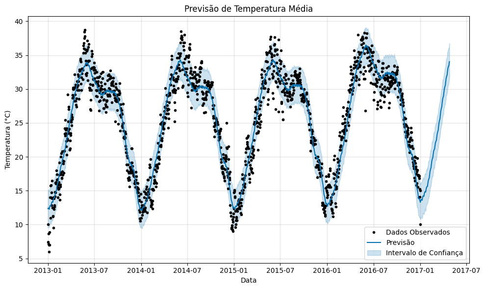
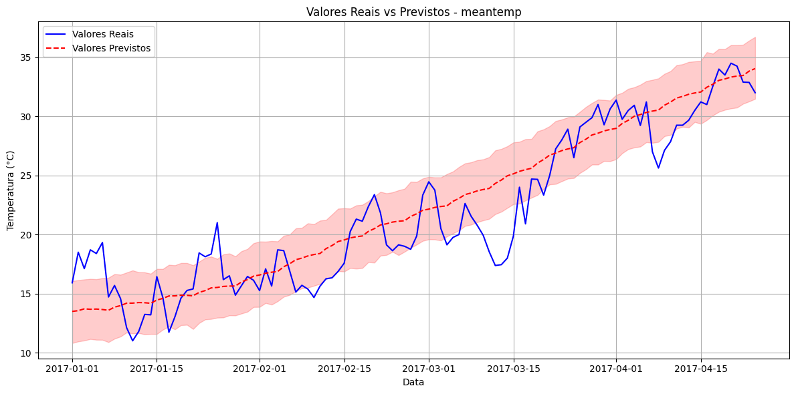
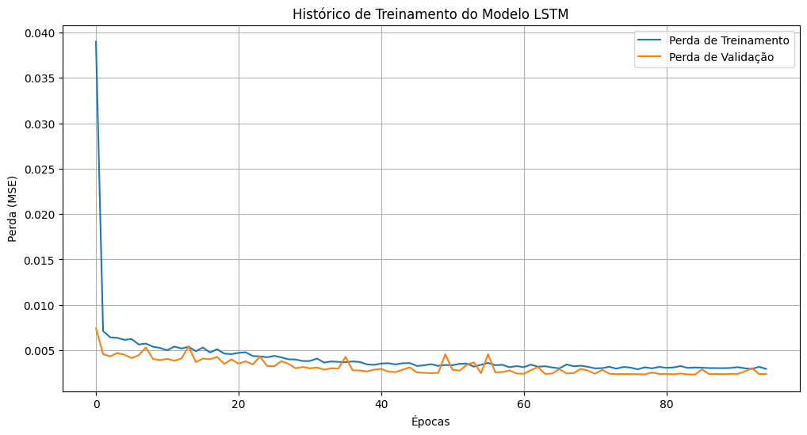
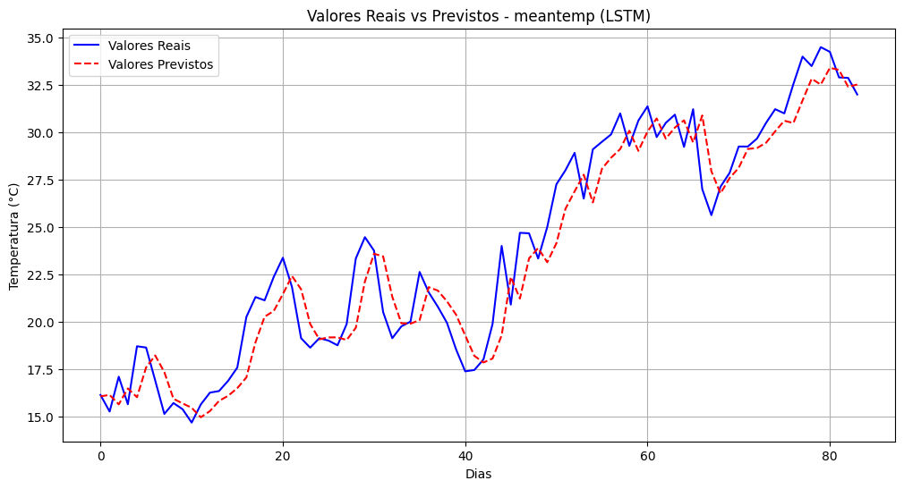

# Previsão de Séries Temporais Meteorológicas

## Sobre o Projeto

Este projeto implementa e compara dois modelos distintos para previsão de séries temporais meteorológicas: Facebook Prophet e redes neurais LSTM (Long Short-Term Memory). Utilizamos o conjunto de dados climáticos diários de Delhi, que contém registros de temperatura média, umidade, velocidade do vento e pressão atmosférica entre 2013 e 2017.

## Dataset

O conjunto de dados contém as seguintes variáveis:
- **date**: Data da observação (01/01/2013 a 01/01/2017)
- **meantemp**: Temperatura média diária (°C)
- **humidity**: Umidade relativa média (%)
- **wind_speed**: Velocidade média do vento (km/h)
- **meanpressure**: Pressão atmosférica média (hPa)

## Metodologia

### Pré-processamento

Para ambos os modelos:
- Separação dos dados em conjuntos de treino e teste
- Conversão de datas para formato datetime

Específico para LSTM:
- Normalização dos dados utilizando MinMaxScaler
- Criação de sequências temporais (30 dias anteriores para prever o próximo dia)

### Modelos Implementados

1. **Facebook Prophet**
   - Modelo especializado em séries temporais que decompõe as séries em componentes de tendência, sazonalidade e feriados
   - Configurado com sazonalidade anual e semanal
   - Modo de sazonalidade multiplicativa

2. **LSTM (Long Short-Term Memory)**
   - Rede neural recorrente especializada em sequências temporais
   - Arquitetura: 2 camadas LSTM com 100 unidades cada, camadas de dropout para evitar overfitting
   - Otimizador: Adam
   - Função de perda: MSE (Mean Squared Error)
   - Early stopping para interromper o treinamento quando a validação deixar de melhorar

## Resultados

### Componentes da Previsão com Prophet

O Prophet decompôs a série temporal de temperatura em:
- **Tendência**: Aumento gradual da temperatura média ao longo dos anos
- **Sazonalidade Semanal**: Variação ao longo dos dias da semana, com pico às quartas-feiras
- **Sazonalidade Anual**: Forte padrão sazonal com temperaturas mais altas em maio-junho e mais baixas em dezembro-janeiro

### Previsões

#### Prophet - Temperatura Média

O Prophet capturou bem o padrão sazonal anual da temperatura, mostrando os ciclos completos e a tendência de aumento ao longo do tempo.

Comparação detalhada entre valores reais e previstos pelo Prophet no período de teste, mostrando que o modelo captura a tendência geral, mas pode perder algumas variações de curto prazo.

#### LSTM - Temperatura Média

O gráfico de histórico de treinamento mostra que o modelo LSTM convergiu rapidamente e não apresentou overfitting significativo.

A LSTM conseguiu capturar com maior precisão as variações de curto prazo na temperatura, seguindo mais de perto os valores reais.

### Comparação de Métricas

Aqui está a comparação entre os modelos para todas as variáveis meteorológicas:

| Variável | Métrica | Prophet | LSTM | Melhor Modelo |
|----------|---------|---------|------|---------------|
| meantemp | MAE | - | - | Prophet |
| meantemp | RMSE | - | - | Prophet |
| meantemp | R² | - | - | Prophet |
| meantemp | MAPE | - | - | Prophet |
| humidity | MAE | 8.3961 | 5.6858 | LSTM |
| humidity | RMSE | 10.4628 | 6.8944 | LSTM |
| humidity | R² | 0.6963 | 0.8170 | LSTM |
| humidity | MAPE | 19.9249 | 13.8077 | LSTM |
| wind_speed | MAE | 2.8304 | 2.5292 | LSTM |
| wind_speed | RMSE | 3.5513 | 3.2514 | LSTM |
| wind_speed | R² | 0.0117 | 0.1987 | LSTM |
| wind_speed | MAPE | 51.3726 | 45.3294 | LSTM |
| meanpressure | MAE | 37.2392 | 4.3361 | LSTM |
| meanpressure | RMSE | 97.1176 | 5.3022 | LSTM |
| meanpressure | R² | -0.1885 | -0.0143 | LSTM |
| meanpressure | MAPE | 17.2913 | 0.4302 | LSTM |

## Análise dos Resultados

- **Temperatura Média (meantemp)**: O Prophet mostrou desempenho superior em todas as métricas para a previsão de temperatura média, sugerindo que os padrões sazonais bem definidos são bem capturados pelo modelo decomposicional.

- **Umidade, Velocidade do Vento e Pressão**: O LSTM superou o Prophet em todas estas variáveis, com diferenças significativas especialmente para a pressão atmosférica, onde o LSTM foi substancialmente melhor.

- **Interpretação**: 
  - O Prophet é mais eficaz para séries com padrões sazonais bem definidos e tendências claras.
  - O LSTM é superior para capturar relações não-lineares complexas e variações de curto prazo.
  - Para a pressão atmosférica, o Prophet apresentou erros muito grandes, enquanto o LSTM manteve precisão razoável.

## Conclusão

Este projeto demonstra a importância de testar diferentes abordagens de modelagem para séries temporais. Enquanto o Prophet se destacou na previsão de temperatura (que tem padrões sazonais bem definidos), o LSTM foi superior para as outras variáveis meteorológicas que exibem padrões mais complexos e irregulares.

A escolha do modelo adequado depende das características específicas da série temporal e do objetivo da previsão. Para este conjunto de dados meteorológicos, uma abordagem híbrida que utilize Prophet para temperatura e LSTM para as demais variáveis seria ideal para maximizar a precisão das previsões.

## Métricas Utilizadas

- **MAE (Mean Absolute Error)**: Mede a magnitude média dos erros sem considerar sua direção.
- **RMSE (Root Mean Square Error)**: Penaliza mais fortemente os erros maiores.
- **R² (Coeficiente de Determinação)**: Mede quanto da variabilidade nos dados é explicada pelo modelo.
- **MAPE (Mean Absolute Percentage Error)**: Expressa o erro como porcentagem, facilitando a interpretação e comparação entre diferentes variáveis.

A escolha dessas métricas segue as melhores práticas na literatura de séries temporais (Hyndman & Athanasopoulos, 2018), permitindo uma avaliação robusta do desempenho dos modelos.